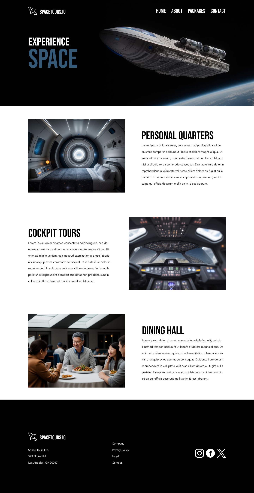

# COMP-1054 Main Project

Live here: ...

## Validation

I use Prettier to format and validate my code. The code (HTML, CSS and JS) will not format if there are any errors in the code.

## Wireframe

